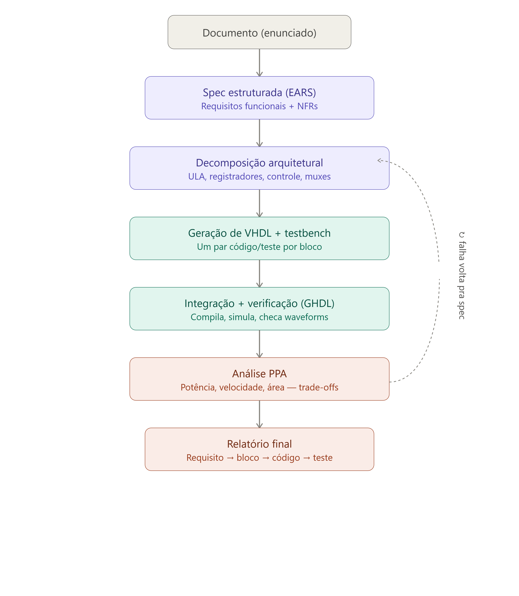

# SpecHDL

Pipeline spec-driven que parte de um formulário web local (Streamlit,
`spechdl web`) — o aluno responde perguntas true/false e campos técnicos
(cache, estágios de pipeline, largura de palavra etc.), não escreve nada
livre — extrai requisitos estruturados, decompõe em blocos de hardware
(ULA, banco de registradores, unidade de controle, muxes etc.), gera VHDL +
testbenches, verifica no GHDL e produz um relatório de trade-offs de
potência, velocidade e área (PPA). Ao submeter, o app grava `rubrica.md`
(versionável) e o pipeline roda sozinho até o relatório final — preencher e
submeter o formulário é a única responsabilidade do aluno.

O projeto em si é construído seguindo a metodologia que ele implementa:
**nenhuma linha de código antes de uma spec aprovada** — ver
[`specs/constitution.md`](specs/constitution.md), princípio 1.

## O pipeline



> O diagrama acima é do conceito original (entrada em texto livre); a
> entrada real hoje é o formulário Streamlit — ver `specs/spec.md`, Fase 1.

1. **Ingestão** — o formulário web (Streamlit) preenchido pelo aluno vira um
   conjunto de requisitos estruturados em notação EARS (`spec.json`); uma
   submissão com respostas inconsistentes é bloqueada, apontando o campo.
2. **Decomposição arquitetural** — a spec aprovada vira uma proposta de
   blocos de hardware, cada decisão justificada por pelo menos um requisito
   não-funcional (potência, velocidade ou área).
3. **Geração de VHDL + testbench** — cada bloco vira um arquivo VHDL e um
   testbench [cocotb](https://www.cocotb.org/) (Python), ambos rastreando o
   ID do requisito que implementam.
4. **Verificação** — cada bloco (e depois o design integrado) é compilado e
   simulado de fato no GHDL, orquestrado pelo cocotb; falha de simulação é
   reportada junto do requisito não atendido.
5. **Análise PPA** — síntese real via Yosys + `ghdl-yosys-plugin` para
   contagem de células/área, em vez de a IA estimar métricas "no chute".
6. **Relatório final** — rastreia cada requisito até o bloco, o arquivo
   VHDL, o resultado do teste e a métrica de PPA correspondente.

## Estado atual

O projeto está na **Fase 0/1** — a especificação está concluída e alinhada,
e as duas primeiras tarefas do pipeline já são código real e testado.

**Pronto:**
- Constituição, spec funcional (EARS, FR-01–FR-15), plano técnico e backlog
  de tarefas em [`specs/`](specs/), revisados e consistentes entre si.
- **T0.1** — estrutura de pastas do pipeline (`src/spechdl/`, `tests/`,
  `outputs/`) e ambiente virtual Python.
- **T1.1** — schema completo da rubrica em
  [`src/spechdl/ingestion/schema.py`](src/spechdl/ingestion/schema.py) (137
  campos em 8 seções: modelo da máquina, ISA, microarquitetura, hierarquia
  de memória, E/S, proteção, PPA, ABI), com skip logic e validação cruzada
  (FR-03). O formulário
  ([`web_form.py`](src/spechdl/ingestion/web_form.py)) renderiza esse
  schema e roda de verdade — abre com
  [`abrir_formulario.bat`](abrir_formulario.bat) (duplo clique) sem prompt
  de telemetria pra atrapalhar, grava `outputs/rubrica.md` ao submeter, e
  já foi testado ponta a ponta (`streamlit.testing`, mais um teste manual
  seu). O parser pra `spec.json` em EARS (T1.2) ainda não existe.
- Smoke test de toolchain (GHDL + cocotb) em
  [`examples/toolchain_smoketest/`](examples/toolchain_smoketest/), com CI
  em [`.github/workflows/toolchain-smoketest.yml`](.github/workflows/toolchain-smoketest.yml).
- Duas execuções de referência do método SDD completo (ponta a ponta, com
  verificação real via GHDL+cocotb em Docker, re-testada localmente) em
  [`examples/ula32_sol/`](examples/ula32_sol/) e
  [`examples/ula32_terra/`](examples/ula32_terra/) — geradas por um agente
  externo contra o modelo antigo (texto livre), não são fixtures de rubrica,
  mas provam que a metodologia funciona ponta a ponta.

**Pendente (backlog completo em [`specs/tasks.md`](specs/tasks.md)):**
- T0.2–T0.5 — validar GHDL/cocotb/GTKWave e Yosys de fato (só testamos via
  Docker contra o exemplo de referência, não contra o smoke test oficial
  ainda), configurar `OPENROUTER_API_KEY` e criar o exemplo fixo com rubrica
  preenchida (fixture real das fases seguintes).
- T1.2–T1.4 e todo o restante do pipeline (Fases 2 a 7): parser EARS,
  decomposição, geração, verificação, PPA, relatório e CLI instalável
  (`spechdl web`).

## Especificações — leia nesta ordem

| Ordem | Arquivo | Conteúdo |
|---|---|---|
| 1 | [`specs/constitution.md`](specs/constitution.md) | Princípios inegociáveis do projeto |
| 2 | [`specs/spec.md`](specs/spec.md) | Requisitos funcionais/não-funcionais (EARS) do pipeline |
| 3 | [`specs/plan.md`](specs/plan.md) | Arquitetura técnica, estrutura de pastas, contratos JSON entre fases |
| 4 | [`specs/tasks.md`](specs/tasks.md) | Backlog atômico, fase por fase |

O [`CLAUDE.md`](CLAUDE.md) na raiz resume as regras de comportamento pra
quem (ou qual agente) for implementar o pipeline em cima dessa spec.

Uma versão visual — diagrama do pipeline (formulário → EARS → decomposição
→ VHDL → verificação, com a triagem de falha e a checagem manual no
GTKWave), árvore do repositório e status por fase — está em
[`docs/mapa-do-projeto.html`](docs/mapa-do-projeto.html) (abra localmente no
navegador). É uma foto do estado do repo num momento; a fonte de verdade
continua sendo `specs/tasks.md`.

## Estrutura do repositório

```
.
├── CLAUDE.md                       # instruções de comportamento pro Claude Code
├── README.md
├── pipeline_sdd_hardware.png       # diagrama do pipeline (conceito original)
├── abrir_formulario.bat            # atalho dev: duplo clique sobe o formulário
├── .gitignore · .env.example       # OPENROUTER_API_KEY, SPECHDL_LLM_MODEL
├── .streamlit/config.toml          # desliga o prompt de telemetria/e-mail
├── docs/
│   └── mapa-do-projeto.html        # versão visual: diagrama + árvore + status
├── specs/
│   ├── constitution.md
│   ├── spec.md
│   ├── plan.md
│   └── tasks.md
├── templates/
│   └── rubrica.md                  # visão geral estrutural — schema.py é a
│                                    # fonte de verdade real do schema
├── src/spechdl/
│   ├── ingestion/schema.py         # 137 campos, skip logic, validação cruzada (T1.1)
│   ├── ingestion/web_form.py       # formulário Streamlit — código real, T1.1
│   └── architecture/ codegen/ verification/ ppa/ report/  # pacotes vazios ainda
├── tests/                          # testes pytest do pipeline (ainda vazio)
├── outputs/                        # artefatos gerados por execução (gitignored)
├── examples/
│   ├── toolchain_smoketest/        # smoke test do toolchain GHDL+cocotb (T0.2)
│   │   ├── src/demux.vhd
│   │   └── test/{test_demux.py, Makefile}
│   ├── ula32_sol/                  # referência: SDD ponta a ponta, modelo antigo (texto livre)
│   └── ula32_terra/                # idem, rodado por um segundo agente isolado do primeiro
├── scripts/
│   └── llm_playground.py           # manda um prompt solto pro modelo via OpenRouter (T0.4)
└── .github/workflows/
    └── toolchain-smoketest.yml
```

O exemplo real da disciplina com rubrica preenchida (`examples/alu_4bit/`
ou equivalente, T0.5) ainda não foi criado — ver estrutura completa
proposta em [`specs/plan.md`](specs/plan.md).

## Stack

- Python 3.11+ (venv — 3.12 já validado)
- [Streamlit](https://streamlit.io/) — formulário web local da fase 1, único
  ponto de entrada do pipeline; já rodando
  ([`src/spechdl/ingestion/web_form.py`](src/spechdl/ingestion/web_form.py)).
  O comando final será `spechdl web` (Fase 7, ainda não implementado); por
  ora é `streamlit run` direto ou `abrir_formulario.bat`
- [OpenRouter](https://openrouter.ai/docs) (SDK nativo) — extração de spec,
  decomposição arquitetural e geração de VHDL (`OPENROUTER_API_KEY` via
  variável de ambiente, modelo via `SPECHDL_LLM_MODEL`, nunca hardcoded)
- [GHDL](https://github.com/ghdl/ghdl) — compilação/simulação VHDL
- [cocotb](https://www.cocotb.org/) — testbenches em Python sobre o GHDL
- [GTKWave](https://gtkwave.sourceforge.net/) — inspeção visual do waveform
  (`.vcd`) na triagem manual de falha
- [Yosys](https://github.com/YosysHQ/yosys) + `ghdl-yosys-plugin` — síntese
  real para as métricas de PPA
- pytest — testes do próprio pipeline (não confundir com os testbenches
  cocotb gerados, que testam o hardware)
- python-dotenv — carrega `.env` em desenvolvimento local

Ambiente de referência: Linux/WSL2, imagem Docker
`rafaelcorsi/pl-descomp-cocotb` (mesma usada no smoke test de CI).

## Próximo passo

Testar o formulário (`abrir_formulario.bat`) e, se estiver bom, seguir pra
`T1.2` em [`specs/tasks.md`](specs/tasks.md): o parser que transforma
`rubrica.md` em requisitos EARS estruturados (`spec.json`).
